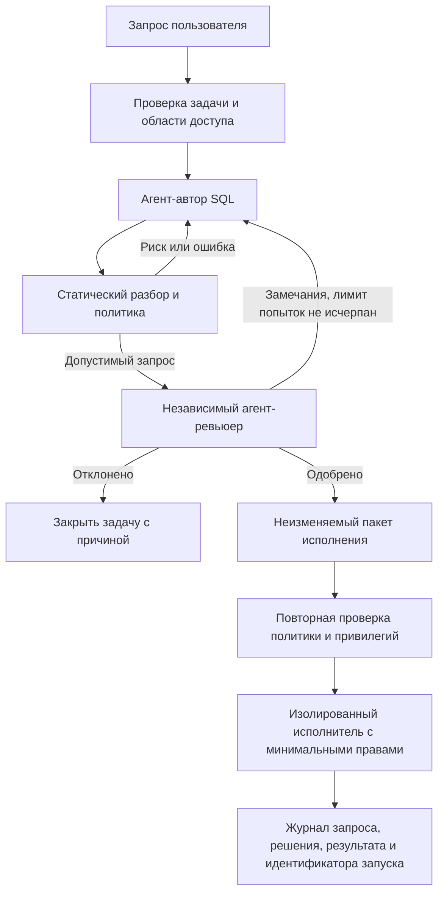

# Агентный IT-отдел и контролируемое выполнение SQL

## Цель

Добавить к Kovalsky отдельный контур разработки и проверки SQL: агент-автор формирует запрос и объяснение, агент-ревьюер независимо проверяет безопасность и соответствие задаче, а исполнитель получает только неизменённый запрос с подтверждённым решением. Контур не связан с редакционным конвейером.

## Что есть сейчас

Kovalsky — Python-приложение новостного мониторинга. `newsroom/db.py` создаёт локальную SQLite-базу для состояния приложения. В проекте нет LangGraph, отдельного production-коннектора, модели прав боевой БД или разрешённого списка схем и таблиц. Поэтому локальная SQLite не является целевой базой этого контура и не должна использоваться как её подмена.

## Целевой граф

Автор и ревьюер — отдельные роли с разными системными инструкциями и независимым контекстом. Ревьюер не доверяет объяснениям автора: он анализирует фактический SQL, исходную задачу, схему и ограничения доступа. Только `APPROVED` для точной версии SQL может перейти к исполнению. Любое изменение SQL после ревью сбрасывает решение.

## Инварианты безопасности

1. По умолчанию никакое соединение с БД не открывается; сначала внедряется режим `plan`/`dry-run`.
2. У агента нет учётных данных БД. Они принадлежат отдельному исполнителю и берутся из секретного хранилища, не из промпта, конфигурации или журнала.
3. Ревьюер не может сам выполнить SQL, а исполнитель не может менять одобренный SQL.
4. Политика проверяется детерминированно до и после AI-ревью. Текстовое одобрение модели не заменяет парсер, проверку прав и ограничения БД.
5. Начальный production-контур — только чтение, только разрешённые схемы/таблицы, ограничение времени, строк и объёма результата. Запрещены несколько выражений, DDL/DML, системные каталоги, опасные функции и обходы через комментарии/CTE/подзапросы, если они не разрешены политикой.
6. Запрос параметризуется. Секреты и персональные данные результата редактируются до передачи агенту или журналирования.
7. Для записи в БД нужен отдельный профиль политик с транзакцией, проверяемым планом изменений и дополнительным контролем; он не включается настройкой общего read-only режима.
8. Тайм-аут, потеря соединения или неопределённый результат фиксируется как `UNKNOWN`; автоматический повтор потенциально изменяющей операции запрещён.
9. Лимит циклов доработки конечный. После его исчерпания запрос закрывается без выполнения.
10. Журнал append-only связывает задачу, входные ограничения, хеш SQL, версии авторской/ревьюерской моделей, вердикт, версию политики и результат исполнения.

## Предлагаемые состояния

`RECEIVED → DRAFTING → STATIC_CHECK → REVIEWING → REVISION_REQUIRED → APPROVED → EXECUTING → SUCCEEDED | FAILED | UNKNOWN`

Также возможен терминальный `REJECTED`. Переход к `EXECUTING` разрешён только из `APPROVED`, если хеш SQL совпадает с проверенным хешем, политика не изменилась, исполнитель доступен и его роль ограничена требуемыми правами. Повтор из `UNKNOWN` сначала сверяет состояние/идентификатор операции с базой; вслепую повторять нельзя.

## Компоненты

- **Оркестратор:** граф состояний, дедлайны, ограничение циклов, отмена и восстановление после перезапуска. LangGraph подходит для этого слоя, если его зависимости и модель персистентности будут приемлемы для текущего Python-приложения.
- **Агент-автор:** получает задачу, утверждённую схему и контракт вывода; возвращает SQL, параметры, объяснение и предполагаемые таблицы.
- **Статический шлюз:** парсит SQL диалектом целевой БД, отвергает неизвестные конструкции и проверяет allowlist. Regex не считается SQL-парсером.
- **Агент-ревьюер:** получает задачу, SQL, доступную схему и результат статической проверки; возвращает структурированный вердикт, замечания и категории риска.
- **Исполнитель:** единственный компонент с сетевым доступом и секретами. Работает через read-only principal, statement timeout, row limit и отдельное сетевое правило.
- **Аудит:** сохраняет переходы и хеши без секретов и необработанных чувствительных результатов.

## Этапы внедрения

1. **Уточнить целевую среду:** СУБД и версия, размещение, какие схемы/таблицы разрешены, исключительно чтение или конкретный набор изменений, политика персональных/финансовых данных, сетевой/секретный менеджер и лимиты запросов.
2. **Прототип без подключения к production:** типизированные состояния и события графа, фиктивные агенты, SQL-пакет, политика отказа по умолчанию, ограниченные ревью-циклы и аудит в отдельном изолированном хранилище. Демонстрация завершается на `APPROVED`; реального исполнения нет.
3. **Тестирование на синтетической БД:** целевой диалект, обходы политик, инъекции, многокомандные запросы, недоступность моделей, тайм-ауты, перезапуски, конкурентное изменение версии запроса.
4. **Read-only пилот:** отдельный реплика/пользователь с минимальными правами, allowlist и лимитами. Начать с `EXPLAIN`/проверки плана, затем выдавать только ограниченные результаты.
5. **Расширение действий:** только после отдельного определения политик, ролей, отката, идемпотентности и журнала для изменяющих запросов.

## Решения, необходимые для перехода к реализации

- Какая production-СУБД и диалект SQL?
- Какие источники схемы доступны агентам и какие таблицы/операции разрешены?
- Под «летит в боевую базу» подразумевается read-only аналитический запрос или изменение данных/схемы?
- Какой провайдер моделей и где должны храниться секреты/аудит?

До фиксации этих параметров допустимо реализовать и демонстрировать граф до состояния одобрения на фиктивных данных. Реальное подключение к боевой БД должно оставаться выключенным.
